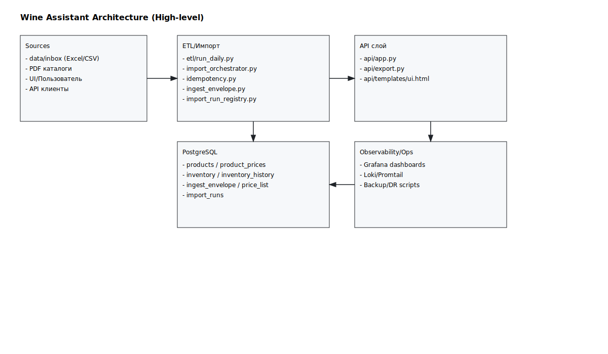

# Architecture Diagram

Below is a high-level architecture overview of Wine Assistant.

```mermaid
flowchart LR
  subgraph Sources[Источники данных]
    Inbox[data/inbox (Excel/CSV)]
    PDF[PDF каталоги]
    UIClient[UI/Пользователь]
    APIClient[API клиенты]
  end

  subgraph ETL[ETL/Импорт]
    RunDaily[etl/run_daily.py]
    Orchestrator[scripts/import_orchestrator.py]
    Idempotency[scripts/idempotency.py]
    Envelope[scripts/ingest_envelope.py]
    RunRegistry[scripts/import_run_registry.py]
  end

  subgraph API[API слой]
    App[api/app.py]
    Export[api/export.py]
    UI[api/templates/ui.html]
  end

  subgraph DB[PostgreSQL]
    Products[products]
    Prices[product_prices]
    Inventory[inventory]
    InventoryHistory[inventory_history]
    IngestEnvelope[ingest_envelope]
    PriceList[price_list]
    ImportRuns[import_runs]
  end

  subgraph Observability[Observability/Ops]
    Grafana[Grafana dashboards]
    Loki[Loki/Promtail]
    Ops[Backup/DR scripts]
  end

  Inbox --> Orchestrator
  PDF --> RunDaily
  Orchestrator --> RunRegistry
  Orchestrator --> Envelope
  Orchestrator --> Idempotency
  RunDaily --> Products
  RunDaily --> Prices
  RunDaily --> Inventory
  RunDaily --> InventoryHistory
  Envelope --> IngestEnvelope
  Envelope --> PriceList
  RunRegistry --> ImportRuns

  App --> Products
  App --> Prices
  App --> Inventory
  App --> InventoryHistory
  Export --> App
  UI --> App

  App --> Grafana
  Grafana --> Loki
  Ops --> DB
```

## SVG export


